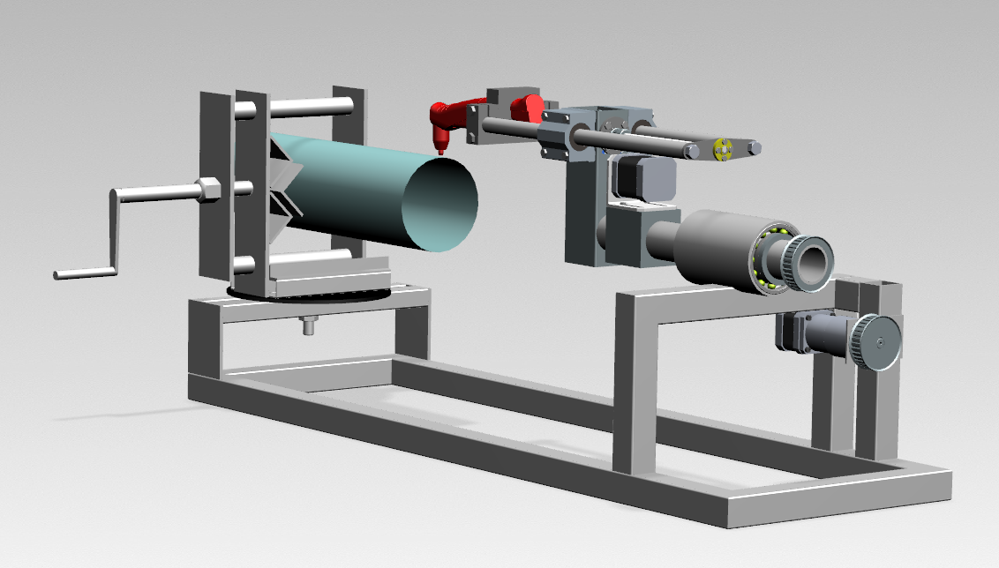

# Wycinarka plazmowa do rur oparta na Arduino v0.1

## 1. Wstęp
Repozytorium zawiera kod oprogramowania wycinarki plazmowej do rur oparty na Arduino oraz makro do FreeCada do generacji geometrii ciętej rury oraz generacji GCode do tej konkretenej maszyny. 

Wyjściowym kodem do oprogramowania był kod SPhereBota z repozytorium: https://github.com/zaggo/SphereBot

Pod względem mechanicznym wycinarka była oparta na projekcie: https://www.youtube.com/watch?v=qnYNEfv5IaY

Rozwiązania mechaniczne, umiejscowienie silników i ogólny wygląd i opis maszyny można znaleźć w [Raport z części prac](przydatne_pdfy/Raport_z_czesci_prac.pdf) , przyczym pod względem sterowania program uległ znacznym zmianom w porównaniu do opis z przełomu 2017/2018, dodatkowo opracowano makra nie uwzględnione w tamtym raporcie.

Warto dodać główne założenie projektu: cięta rura jest nieruchoma, a wzdłuż się osi (za ruch wzdłuż odpowiada silnik związany z osią X) oraz po obwodzie rury (odpowiada za to silnik związany z osią Y).

## 2. Schemat podłączenia
Schemat podłączenia elementów do płytki Arduino i zestaw części można znaleźć na schemacie [Schemat podłączenia](projekt_sterowania_wycinarka_plazmowa.pdf)

## 3. [Kod Arduino](arduino)
### 3.1 Zalety i wady
+Wycinarka wykonuje swoją pracę na podstawie GCode, który jest przekazywany na karcie microSD (działa bez komputer).

+GCode może być napisany ręcznie/ otrzymany za pomocą makra, które zostanie później omówione lub utworzony ad hoc podczas pracy wycinarki w trybie wprowadzania (omówione niżej).Program wykorzystuje ekran LCD i klawiaturę membranową do wprowadzania danych.

+Dodatkowo wyposażony jest w funkcje zerowania położenia silników (autoHoming) za pomocą endstopów. 

+Serwomechanizm odpowiada natomiast za włączenie/wyłączanie palnika wycinarki.

+Krzywa może być wyrażona jako rozwinięcie na rurze, w zakresie 0-PI*ŚrednicaRury lub -PI*ŚrednicaRury/2, w [mm]

+Krzywa może być wyrażona w stopniach, w zakresie 0-360[deg] lub -180 - 180[deg]

+Krzywa może być wyrażona w radianach, w zakresie 0-2PI lub -Pi - Pi 

+Możliwość łatwego przekształcenia na ploter XY w [mm]

+Możliwość ustalenia maksymalnego zakresu obu silników -> zabezpieczenie przed zaplątaniem i zerwaniem kabli

-Konieczność zdefiniowania odpowiednich średnic, które informują o tym jaką zmianę położenia palnika powoduje jeden obrót silnika (omówione zostanie w rozdziale o uruchomieniu programu!!), by zapewnić odpowiednią synchronizację silników.

-Brak awaryjnego przycisku STOP, który wyłączyłby palnik (ruch serwem na 0) oraz silniki

### 3.2 Jak zacząć
1. Aby uruchomić program ściągnij pliki z [Kod Arduino](arduino) . Dodatkowo będzie potrzebna zmiana nazwy pobranego folderu z arduino na wycinarka_plazmowa.

2. Ściągnij i zainstaluj wszystkie niezbędne biblioteki:

	>SoftwareServo: http://www.arduino.cc/playground/ComponentLib/Servo
	
	>TimerOne: http://www.arduino.cc/playground/Code/Timer1
	
	>Keypad.h https://playground.arduino.cc/Code/Keypad
	
	>LiquidCrystal.h https://playground.arduino.cc/Main/LiquidCrystal
	
	>SD.h https://www.arduino.cc/en/Reference/SD
	
	>SPI.h https://www.arduino.cc/en/reference/SPI
	
	
	
3. Połącz układ tak jak przedstawiono na [Schemat podłączenia](projekt_sterowania_wycinarka_plazmowa.pdf)

4. Ustaw odpowiednie napięcie na sterownikach silników w zależności od modelu:
(https://howtomechatronics.com/tutorials/arduino/how-to-control-stepper-motor-with-a4988-driver-and-arduino/)

5. Przejżyj kody programu, które zostały dokładnie opisane komentarzami.

	Plik **config.h** zawiera ustawienia podłączenia pinów, deklaracje i ustawienia wartości domyślne wszystkich komponentów układu.

	Plik **StepperModel** jest deklaracją klasy silnika i zawiera jego zmienne/ustawienia oraz funkcje za pomocą których możemy manipulować silnikiem (m.in. sterowanie ruchem, prędkością, rodzajem zmiennych, w których czytany jest GCode, autoHoming itd.)

	Plik **wycinarka_plazmowa.ino** zawiera główny program wycinarki.

6. Określ wartości w pliku config.h. Określ przełożeń mechanicznych silników (GEAR_RATIO), określ microstepping domyślnie jest równy 16 i wartości pinów MS1,MS2,MS3 są ustawione na HIGH (VMS1 HIGH , VMS2 HIGH ,VMS3 HIGH). Patrz opisy microstepping do sterników silników np.: do sterownika A4988. Jeśli zmieniałeś PINy, zmień ich numery w config.h. Możesz zmienić rodzaje endstopów itd.

7. Określ domyślną średnicę dla obu silników (DEFAULT_DIAMETER). Informuje ona o tym jak o ile zmieni się położenie w [mm] głowicy wycinarki w danym kierunku po 1 obrocie silnika. 1 obrót = Pi * DeafultDiameter. W przypadku osi Y średnica ta jest po prostu równa średnicy ciętej rury i jest modyfikowana za pomocą gcodu **M401S...** . W przypadku osi X na 1 obrót będzie przypadać np.: skok śruby trapezowej, więc DefaultDiameter=(skok śruby trapezowej)/PI. Odpowiednie dobrane średnice zapewniają synchronizacje silników, także gdy oś Y podana jest w stopniach.

8. Wgraj program do swojego Arduino

9. Napisz swój GCode korzystając z komend przedstawionych w rodziałem 3.3.1, wykorzystaj makro go generacji geometri i Gcode przedstawione poniżej i wgraj program na kartę microSD lub wykorzystaj tryb wprowadzania przedstawiony w 3.3.2.

10. Uruchom wycinarkę!

### 3.3 Tryby pracy
#### 3.3.1 Tryb odczytu
Polega na odczycie komend GCode z pliku zapisanego na karcie microSD. Gcode w takiej formie można otrzymać używając do tego stworznego w tym celu makra do FreeCada. Dostępne komendy:

**G0X...Y...** Szybki ruch na współrzędne X i Y

**G1X...Y...F...** Ruch roboczy na współrzędne X I Y

**G1F...** F-szybkość posuwu w mm/min

**G2X...Y...I...J...** Ruch po okręgu zgodnie z wskazówkami zegara, do punktu X,Y o środku w I,J (UWAGA, komenda dodana przeze mnie, więc też wymaga testów)

**G3X...Y...I...J...** Ruch po okręgu przeciwnie do wskazówek zegara, do punktu X,Y o środku w I,J

**G20** Oś Y wyrażona w mm, by odpowiednio odczytywać Gcode wyrażony w mm

**G21** Oś Y wyrazona w radianach, by odpowiednio odczytywać Gcode wyrażony w radianach 

**G22** Oś Y wyrazona w stopniach , by odpowiednio odczytywać Gcode wyrażony w stopniach

**G4P...** Przerwa ... milisekund

**G90** Pozycjonowanie absolutne

**G91** Pozycjonowanie przyrostowe

**G92** AutoHoming - zerowanie silników

**M18** Wyłączenie silników

**M300S...** Ustawienie serwa od 0-180

**M400S...** Zmiana domyślnej średnicy osi X (średnica wynika z konstrukcji przełożenia ruchu obrotowego na postępowy)

**M401S...** Zmiana domyślnej średnicy osi Y (średnica==średnica ciętej rury)

#### 3.3.2 Tryb wprowadzania (CamModule)
Tryb umożliwiający wycięcie połowy otworu prostopadłego do osi rury o wybranej średnicy na końcy rury lub ucięcie rury płaszczyzną, na podstawie danych wprowadzonych przez użytkownika w trybie interaktywnym za pomocą membranowej klawiatury. W tym przypadku nie potrzeba ręcznego pisania Gcode, ani jego generacji w komputerze, lecz jest on tworzony już w Arduino. Więcej na jego temat [Opis trybu wprowadznia](przydatne_pdfy/tryb_wprowadzania.pdf) oraz matematyczne zależności, na których został oparty [Artykuł o rozwijaniu krzywej na cylindrze](przydatne_pdfy/apostol_unwrapping.pdf.pdf)

## 4. [Makra do generacji geometrii ciętej rury i generacji GCode we FreeCadzie](FreecadMakro)
### 4.1 Instalacja
Do działania makr potrzebny jest zainstalowany FreeCad w wersji >=0.17 (https://www.freecadweb.org/wiki/Download)
Instrukcje instalacji makr przedstawiono w [Instrukcja do makr](FreecadMakro/instrukcja.pdf) , natomiast same makra można ściągnąć z [Makra](FreecadMakro). Interesują nas tylko pliki z roszerzeniem .FCMacro, natomiast te z rozszerzeniem Pythona zostały dodane, by łatwiej było przeglądać i edytować kod makra.

### 4.2 Makro do generacji geometrii rury
Makro pozwala na generację geometrii rury o zadanej przez użytkownika średnicy, grubości, długości, która może być przecięta drugą rurą o dowolnych wymiarach, orientacji w przestrzeni lub może być odcięta płaszczyzną o dowolnej orientacji w przestrzeni. Dane wprowadza się za pomocą przyjaznego w użytkowaniu okna, które zostało stworzone w PySide na podstawie tutoriali (https://www.freecadweb.org/wiki/PySide_Medium_Examples).

Po wprowadzeniu danych generowana jest geometria za pomocą skryptów we FreeCadzie (w Pythonie). Więcej informacji o skryptowaniu we Freecadzie (https://www.freecadweb.org/wiki/Python_scripting_tutorial)

### 4.3 Makro do generacji GCode
Przed uruchomieniem makra do generacji GCode trzeba wybrać krzywe, które będą użyte do generacji GCode!

Makro najpierw dyskretyzuje krzywą na zadaną przez użytkownika liczbę punktów, a następnie transformuje punkty do oczekiwanej przez użytkownika formy.

Dostępne formy to:

>(we wszystkich przypadkach współrzędna X - wzdłuż osi ciętej rury pozostaje bez zmian i jest wyrażona w [mm]):

>-Y wyrażone postaci rozwiniętej krzywej na rurze (powstaje w wyniku transformacji zmiennych Y,Z z kartezjańskich na polarne) w zakresie od 0-Pi * D lub od -PI * D/2 - PI * D/2 [mm]

>-Y wyrażone w stopniach (powstaje w wyniku transformacji zmiennych Y,Z z kartezjańskich na polarne z pominięciem promienia) w zakresie 0-360 stopni lub -180 - 180 stopni

>-Y pozostawione bez zmian w [mm], a współrzędne Z całkowicie pominięta

Po przekształceniach z punktów generowany jest GCode, który może być dowolnie modyfikowany. Jest to zwykły zapis do pliku w Pythonie, więc dowolnie można układać komendy Gcode. 

Mogą występować **problemy z zapisem pliku**. Jeśli występują to należy ustawić stałą ścieżkę dostępu (zmienna **path**), w której będzie zapisywany nasz plik z Gcodem. Możliwe, że konieczna będzie także zmiana kąta pozycji serwomechanizmu dla włączonego i wyłączonego palnika (zmienne **servoON** i **servoOFF**).

Domyślny schemat wygenerowanego Gcode jest następujący:

>1. Zerowanie silników

>2. Najazd szybki na pierwszy punkt krzywej

>3. Włączenie palnika - servo na pozycje servoON

>4. Ruchy robocze na wszystkie punkty po kolei

>5. Wyłączenie palnika

>6. Jeśli są inne krzywe to znowu punkty 2-5

>7. Wyzerowanie silników

>8. Wyłączenie silników

 

